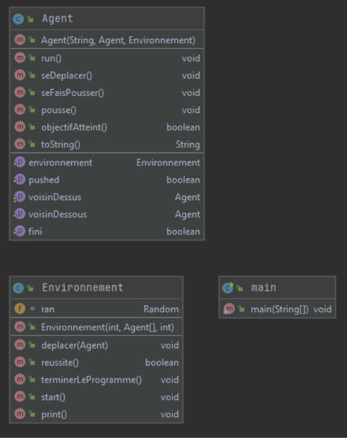
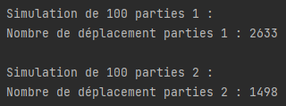
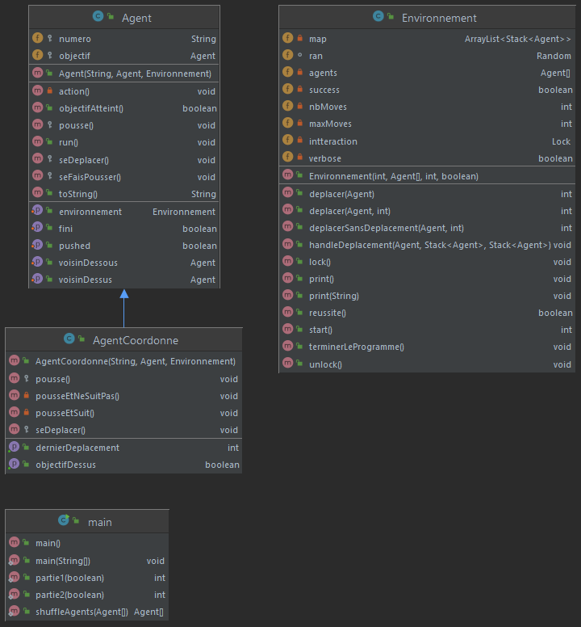

Félix Geffrault
Basile Vandervalle

# multi-agents-blocs

## 1ère Partie:
Chaque agent possède une perception locale, donc chaque agent a dans cet exercice une perception de l’agent en dessous de lui et de l’agent au-dessus de lui. 
De plus, les agents sont capables de pousser l’agent au-dessus de lui. 
Ils perçoivent donc s’ils sont poussés ou non. Son objectif est défini par la référence à l’agent qui doit être en dessous de lui. 
Il possède une dernière variable **“fini”** qui lui permet de s’arrêter lorsque tous les agents ont atteint leur objectif. 

Voici les variables de nos agents:
- ```private String numero;``` -> Identifiant
- ```private Agent voisinDessus;``` -> Perception
- ```private Agent voisinDessous;``` -> Perception
- ```private Agent objectif;``` -> Objectif
- ```private boolean isPushed;``` -> Perception
- ```private Environnement environnement;``` -> pour Action
- ```private boolean fini = false;``` -> Perception

### Diagramme :


Les agents n’ayant pas de perception de l'environnement autre que l’agent au-dessus et en dessous, leurs déplacements sont aléatoires parmi les différents emplacements.
Chaque agent implémentente un thread, ils sont conditionnés par la ressource **Environnement**. 
Si un autre agent effectue une action, les autres agents ne peuvent pas agir. 
La possibilité de laisser plusieurs agents interagir simultanément avec l’environnement, aurait pu créer des scénarios non voulus, 
tel qu’un agent qui quitte sa pile puis se fait doubler sur l’emplacement où il allait se poser par celui qui était précédemment en dessous de lui (si les agents ont la même vitesse).


## 2ème Partie:

Afin d’améliorer les performances de notre programme, on a décidé d’améliorer les performances de coordination et de communication entre les agents. 
Pour cela on a créé une seconde classe agent “**AgentCoordonne**” qui hérite de la classe **Agent**. 
Désormais si un agent perçoit que son voisin du dessus est son objectif, il va alors le pousser et le suivre afin de finir sur la case au-dessus de lui. 
Dans le cas contraire si l’agent du dessus n’est pas son objectif il va le pousser et partir sur l’autre case. 
Cette différence devrait permettre de limiter l’aléatoire et d’optimiser le nombre de coups nécessaires à la résolution du problème.

On a testé les deux phases sur un échantillon de 100 parties aléatoire et on peut observer que la phase 2 est bien plus optimisée.



### Diagramme :


## Utilisation:

Afin de faire fonctionner le code il suffit d'exécuter la fonction static main de la classe **Main**, cette fonction déclenchera tout d'abord la première phase, puis la seconde phase, et lancera finalement la phase 1 et la phase 2 100 fois afin de pouvoir comparer la différence entre les deux méthodes.